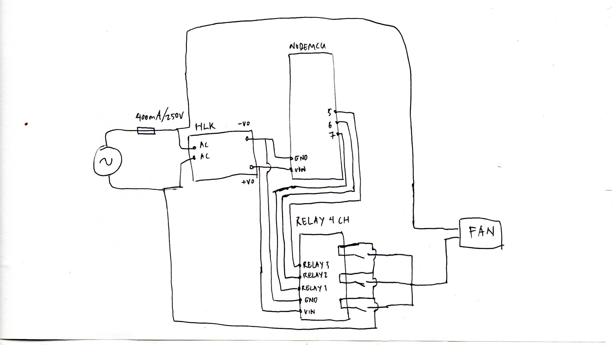
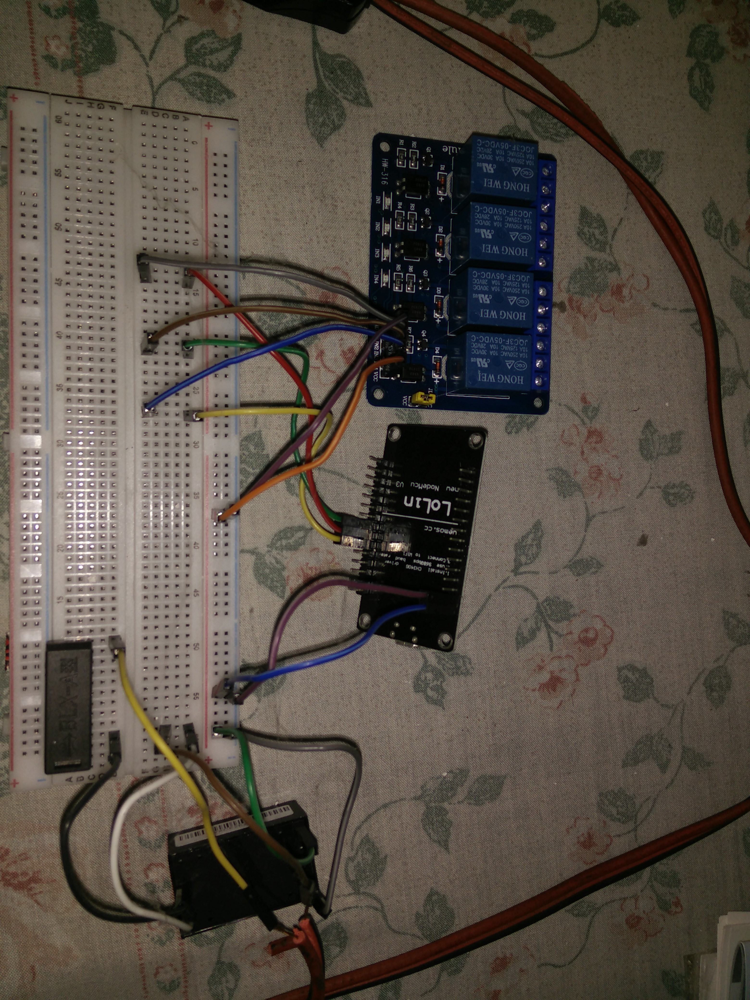
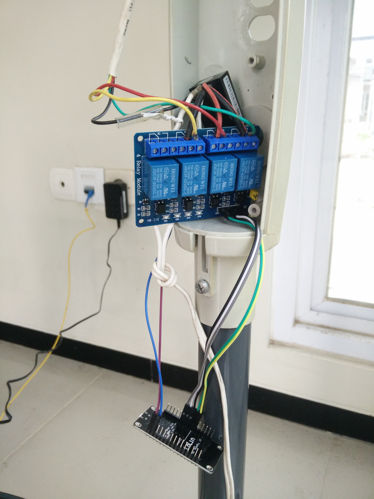

# 4phasefan

Turn ordinary fan into "smart" fan controlled via web server(nodemcu).

(sorry for the images/ video quality)

## How to
1.  Edit SSID and password in 4phasefan_clean.ino.
2.  Flash 4phasefan_clean.ino into nodemcu.

## Schematic
This schematic shows the connection between all the components.

## Test
I arrange all the components in the breadboard for testing.
This is how it looks.

## Live
Arrange all the components inside the real fan.

## Demo
Find the ip address of the "smart" fan and open it in browser.
(i suggest give the "smart" fan static ip address in the router settings)

https://user-images.githubusercontent.com/88121132/169116028-b6e3b4ab-da72-4f1e-b406-d0621123007d.mp4

